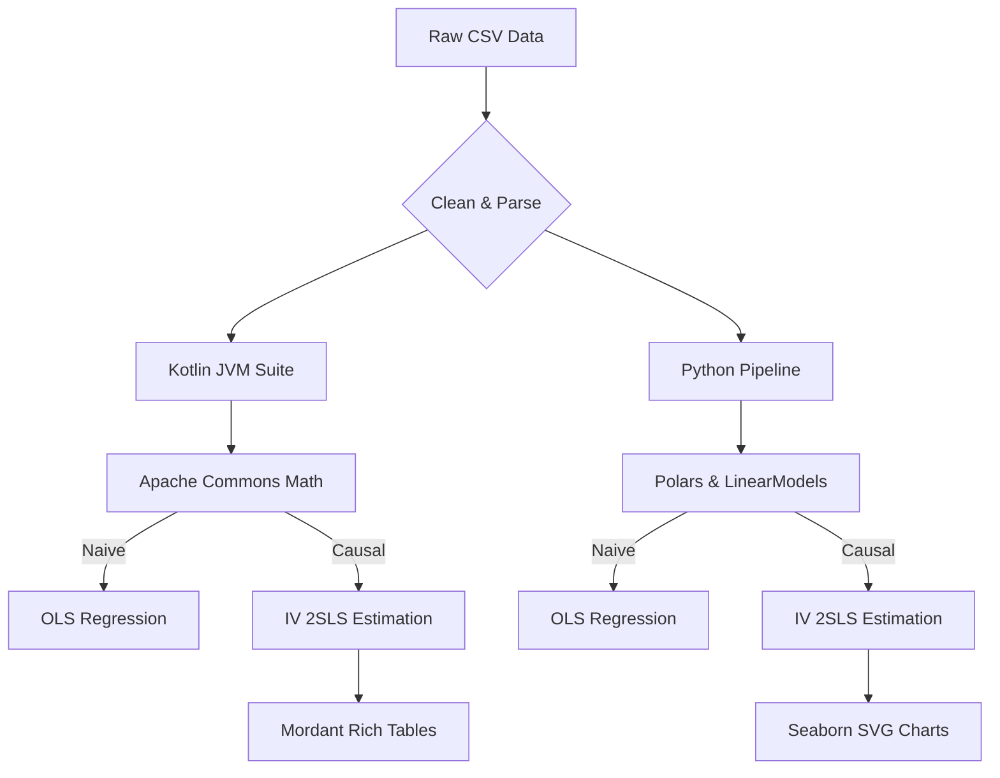
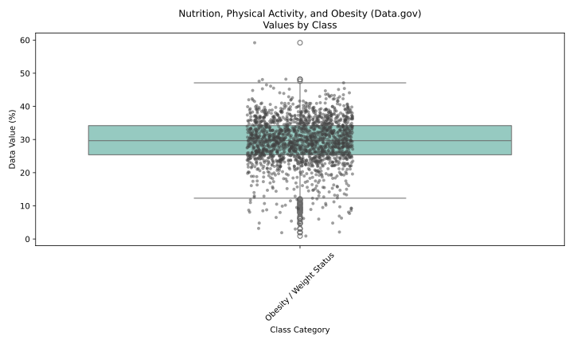
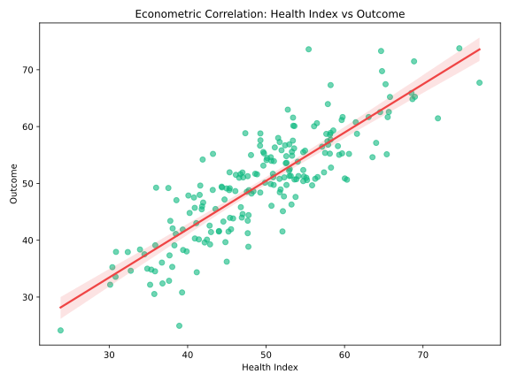

# Econometrics Causal Suite

A comprehensive toolkit for causal inference, regression analysis, and data visualization natively built in **Kotlin**, with parallel implementations in **Python**.

> [!NOTE]
> This suite allows researchers to easily execute OLS and Instrumental Variable (IV) 2SLS regressions on diverse datasets, comparing causal returns versus naive observational estimates.

---

## 📊 Datasets Included

We've curated multiple economic and health datasets, natively supported by our pipeline:

| Dataset Name | Source / Type | Dependent Var ($y$) | Exogenous / Endogenous | Instrument |
|--------------|---------------|---------------------|------------------------|------------|
| **Card (1995)** | Return to Education | `lwage` | `educ` | `nearc4` |
| **Mroz (1987)** | Female Labor Supply | `wage` | `educ`, `exper`, `age` | - |
| **Wage** | Men's Wage | `lwage` | `educ`, `exper`, `tenure` | - |
| **Birthweight** | Impact of Smoking | `bwght` | `cigs`, `faminc` | - |
| **CDC Nutrition** | Data.gov (Public Health) | `data_value` | `class`, `locationdesc` | - |

> [!TIP]
> **Data.gov Fetching**: Use `uv run download_datagov.py` to instantly fetch the CDC's *Nutrition, Physical Activity, and Obesity* dataset directly into your pipeline.

---

## 🏗️ Architecture & Workflow

We utilize a modern dual-language pipeline. Data is read into memory, modeled through multi-stage estimators, and finally rendered as rich terminal tables and beautiful charts.



---

## 💻 Code Examples: Focus on Kotlin

Our Kotlin engine leverages powerful JVM libraries, ensuring lightning-fast in-memory arrays and clean code structure via standard data classes. 

### 1. Estimating Causal Impact (IV-2SLS)

```kotlin
// Stage 1: Regress endogenous variable (e.g. educ) on instrument (e.g. nearc4)
val stage1 = OLSMultipleLinearRegression()
stage1.newSampleData(endogData, zData) // zData includes nearc4 + controls
val s1Beta = stage1.estimateRegressionParameters()

// Predict fitted values (endogHat)
val endogHat = observations.map { /* apply s1Beta */ }

// Stage 2: Regress Outcome (Y) on predicted endogenous (endogHat)
val stage2 = OLSMultipleLinearRegression()
stage2.newSampleData(yData, stage2X)
val causalReturn = stage2.estimateRegressionParameters() // The unbiased β
```

### 2. Running the Full Pipeline

Our build configuration supports seamless execution:

```bash
gradle run -q
```
*(The `-q` flag suppresses Gradle internals, leaving only the beautiful terminal tables!)*

---

## 📈 Visualizations (Python + Kotlin SVGs)

Data visualization is crucial for econometric exploration. We automatically generate boxplots and regression fits.



> [!IMPORTANT]
> The chart above is dynamically fetched from **Data.gov** using Python's `urllib` and `pandas`. It plots real-time public health indicators across different demographic classes.



### Kotlin Charting (`lets-plot`)
We have also set up **Kotlin-native** charting. The `build.gradle.kts` now natively supports JetBrains' `lets-plot-kotlin`. It renders identical charts in HTML format directly from the JVM.
